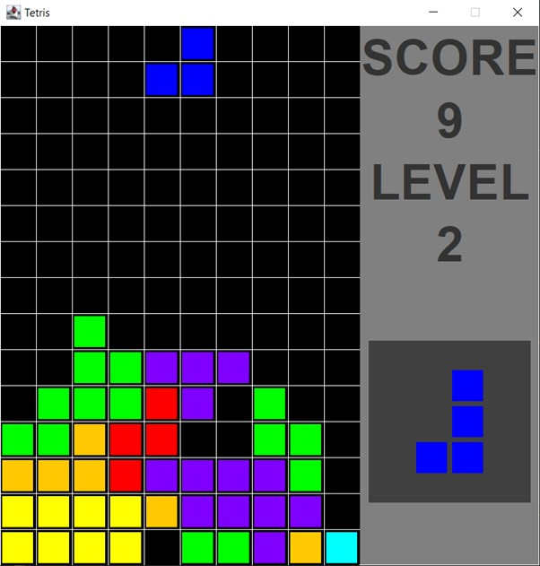

# 1.1 Tetris Game Clone Overview

**Overview written by Peter Mitchell.**

## Contents

```
1.1 Tetris Game Clone Overview
1.2 Introduction
1.3 The Rules of Tetris
1.4 High Level Discussion About Implementation 
1.5 How the Core Game Works 
1.6 Features You Could Add
```
# 1.2 Introduction

This document will explain the fundamentals of how the Tetris game works. 

# 1.3 The Rules of Tetris

Tetris is a game where blocks fall from above and stack into a grid. The following list defines the core
rules of Tetris.

- There are 7 different blocks that can fall down each with their own distinct shape and colour.
- The blocks can be moved left/right, or be rotated. Only if the move would not put it inside
    another block. Blocks can also be moved all the way down.
- Once a block comes to rest on other blocks it stops and becomes a static part of the grid.
- The goal is to fill entire rows. Filling a row will remove the row and award score. The rows
    above the filled row are all shifted down.
- The game ends when blocks can no longer enter the level from the top due to others already
    blocking.
- Gaining more score increases the level, which in turn increases the speed pieces come down.


# 1.4 High Level Discussion About Implementation

The game has been built with a simple structure to represent the necessary information about each
different element. The core game is managed using the TetrisPiece for pieces that are falling down (or
the next piece to be displayed in the PreviewPanel). The TetrisBoard to store a representation of the
locked in pieces. The TetrisPanel to draw the current game state made up of the elements on the
TetrisBoard and TetrisPiece. To support these classes the Position class provides a coordinate
representation. For showing status information about the score, level, and next piece the StatusPanel
class shows labels for the first two and uses a PreviewPanel class to render a TetrisPiece for the next
piece. These classes are then all tied together with the Game class that creates the JFrame and passes
information between the two panels.



# 1.5 How the Core Game Works

Starting with the simplest class, the Position class defines a single position with an x and y coordinate.
As part of the class definition there are constant representations of the unit vectors for
up/down/left/right. The following methods provide functionality to this class.

- Position(): There are two kinds of constructors. The constructor to set a position with an x and
    y coordinate, but also a copy constructor that allows copying of an existing position. This is
    useful for some of the operations that change positions, but where it is necessary to not
    change the actual position unless it succeeds.
- move(): Moves the position by adding the supplied movement vector.

The class TetrisPiece defines a single piece. This is used to represent both the current piece and the
next piece. It includes definitions of all the different layouts of the pieces, the centre for rotation on
pieces, the colours associated with rendering each piece, and data for the actual piece including the
data for that piece with position, centre, and width/height. When a TetrisPiece is created it populates
with a new random piece and positions based on a specified location. The following provide other
functionality to the class.

- paint(): Draws the piece to the board.
- paintAtCentre(): Used to paint the piece into the middle of the PreviewPanel.
- move(): Uses the move() function in Position to move the piece by an amount.
- rotateClockwise(): Attempts to rotate the piece clockwise by transposing the matrix and
    reversing rows then checking if the move would be valid. It is only completed if the move is
    valid.
- rotateCounterClockwise(): Same as rotateClockwise() except it reverses columns instead.
- reset(): Changes to a new random piece.
- getTopLeft(): The piece is offset from the position by the pieceCentre. This method calculates
    and provides the top left coordinate. Useful for many calculations.
- getPieceData(): Gets the raw data representing the piece.
- getPieceWidth(): Gets the width of the piece.
- getPieceHeight(): Gets the height of the piece.
- setupRandomPiece(): Selects a random piece, places it at the start position with information
    set up for the correct centre, width, and height.
- fillPieceData(): Used to populate an array with all the data for the pieces to make random
    selection easy.
- drawPieceUsingOffset(): Used by paint() and paintAtCentre() to provide the duplicate
    functionality by drawing the piece using an offset to the top left in pixels and then drawing
    out based on the width and height.
- swap(): Swaps data in an array between two positions. Used for the rotate methods.


The TetrisBoard defines a grid holding all the pieces that have already been placed. It defines constants
for the grid size and provides numbers to be used for other classes with the width and height in pixels
required for the panel. It also keeps track of a list of matches rows so they can be removed on the next
update. The following methods provide functionality for the class.

- reset(): Fills the grid with empty cells.
- lockInPiece(): Takes a TetrisPiece and fills the grid with its data at the correct location.
- checkForMatches(): Checks all rows for any completely filled rows. Any that are found are
    changed to 8s to make them render as white and are added to the matches array for removal
    during the next update.
- clearMatchedRows(): Removes all rows that were matched during the previous update. All
    rows above them are shuffled down and the top row is filled as being empty.
- isMoveValid(): Checks if the move for a given piece would still be valid within the confines of
    the grid by testing the move calling isValidOnBoard using what would be the new position.
- isValidOnBoard(): Checks if the specified bounding box is inside the grid, and if the data has
    any collisions with existing data on the grid. Directly called during rotations for validation, or
    by the isMoveValid() method.
- paint(): Draws all the filled cells with correct colours for any locked in positions on the board.

The TetrisPanel combines the TetrisBoard with a pair of TetrisPieces to provide most of its
functionality. It is mostly there to contain them and manage the game state by calling appropriate
methods in each of them. The current piece continues to move down, and the next piece points to the
next piece to be shown in the PreviewPanel. A timer is used to keep regular updates ticking, along
with management for input to apply move directions. The class sets itself up by creating the
TetrisBoard, a currentPiece, and nextPiece. Then configures and starts the timer to begin the game.
The following methods provide the additional functionality for this class.

- paint(): Draws the grid, TetrisBoard, current TetrisPiece, and a message if necessary showing
    a game over message or paused message.
- drawGrid(): Draws a grid of lines with vertical and horizontal lines to space out the grid.
- drawCenteredMessage(): Draws a specified message with a white box behind it in the centre
    of the panel. This is used by paint() to draw the game over and pause messages.
- togglePause(): Called when P is pressed to start or stop the timer causing the game to pause
    by making updates stop/start.
- restart(): Resets the score, level, tetris pieces, wipes out the board, and starts the timer for
    more updates again.
- hardDropCurrent(): Forces the current piece to drop down as far as it can instantly.
- lockInPiece(): Ends the game if the piece is locked in outside the grid. Otherwise calls
    lockInPlace() in TetrisBoard to place it on the grid. Then makes the next piece the new current
    piece and creates a new next piece. Any matches are checked for and score/level increases
    applied as needed.
- actionPerformed(): Called when the timer triggers an update. Clears any rows matched before
    the last update, then moves the piece if it can, or calls lockInPiece() if necessary.
- handleKeyEvent(): Checks input passed from the Game class. Block can be moved with
    left/right/down arrow keys. Space to move instantly down. Z/X to rotate. P to pause. R to
    restart. Escape to quit.


The StatusPanel is used to present additional information from the TetrisPanel that does not fit there.
It labels with text for the score and level, in addition to a PreviewPanel that shows the next tetris
piece. The following methods provide functionality for this class.

- setNextPiece(): Passes information on to the PreviewPanel about what the next piece will be.
- setScore(): Updates the label to show the new score.
- setLevel(): Updates the label to show the new level.
- createJLabelFactory(): Used to create each of the JLabels by applying the same font to all of
    them.

The PreviewPanel is a small panel with one distinct job of showing the next Tetris Piece. It simply is
given a reference via the other classes to the next piece that will be used in the TetrisPanel so it can
be rendered. The following methods provide functionality to the class.

- paint(): Draws the piece to the centre of the panel.
- setNextPiece(): Updates to the new nextPiece.

The Game class finally ties everything together by creating a JFrame that contains the TetrisPanel and
StatusPanel with ways for them to communicate. It also contains the entry point for the program. The
following methods provide the functionality for communicating information to the classes.

- setNextPiece(): Passes information from the TetrisPanel through the StatusPanel to the
    PreviewPanel for it to be shown.
- setScore(): Passes information from the TetrisPanel to the StatusPanel to show the new score.
- setLevel(): Same as setScore() but for the level.
- keyPressed(): Triggered when a key is pressed down. It passes the information about the key
    that was pressed on to the handleKeyEvent() method in TetrisPanel.

# 1.6 Features You Could Add

Tetris has many different variations now as it is a popular game. The following list provide some of the
things you could add or change to make it different to what is provided.

- Improve the controls to make rotation work as it is entering the screen. Currently the piece
    must be entirely in the screen to allow rotation.
- Improve rotation when up against walls. Currently it will not rotate some pieces if up against
    walls. You can test with a corrected offset to keep the piece within the grid space to fix this.
- Modify how the score/levels work. Currently the score is very simple (just number of rows
    squared), and the score per level is set very low for testing level speed increases.
- Add in more tetris shapes to try adding some unique variety.
- Look at other existing Tetris clones to see what unique features they have added and try to
    replicate them.
- Come up with your own unique rules or features and apply them to the game.


